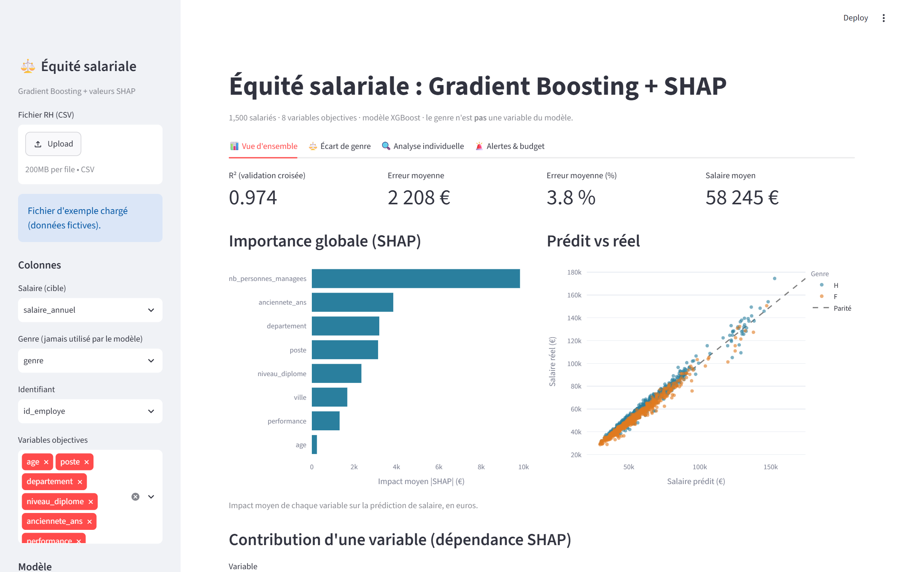
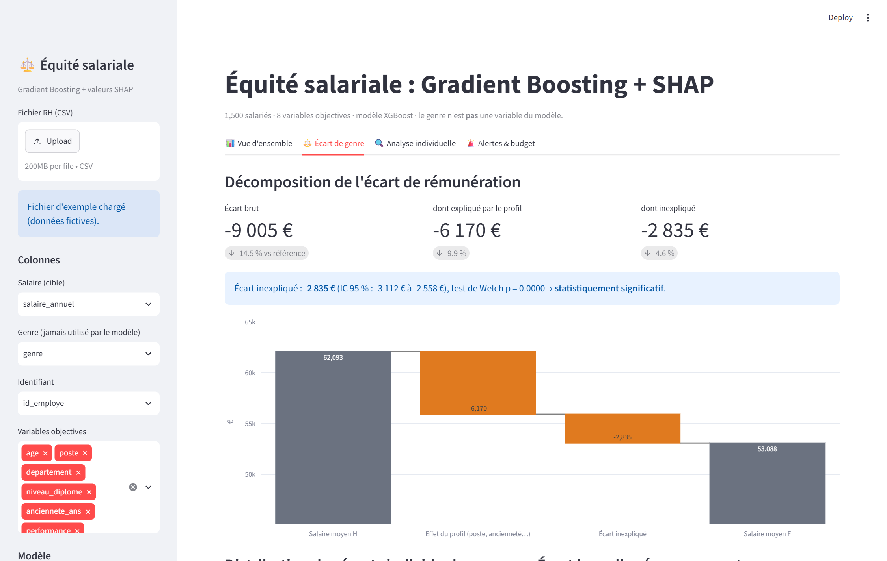
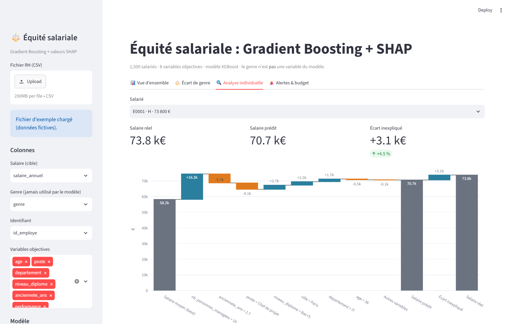
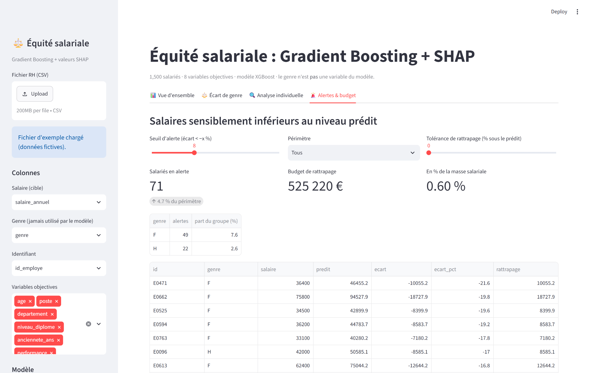

# Équité salariale : Gradient Boosting + SHAP

Application Streamlit qui prédit le salaire « juste » à partir de critères objectifs (poste, ancienneté,
diplôme, performance, responsabilités…) **sans utiliser le genre**, puis explique chaque écart avec les valeurs SHAP.

## Aperçu

**Vue d'ensemble** : performance du modèle et importance globale SHAP



**Écart de genre** : écart brut = écart expliqué + écart inexpliqué



**Analyse individuelle** : cascade SHAP du salaire moyen au salaire réel



**Alertes & budget** : salariés sous le niveau prédit et coût du rattrapage



## Lancer

```bash
pip install -r requirements.txt
python generate_data.py      # régénère data/employes_exemple.csv (optionnel)
streamlit run app.py
```

## Fonctionnement

- **Modèle** : XGBoost ou LightGBM, validation croisée 5 plis. La prédiction et les valeurs SHAP de chaque salarié
  viennent d'un modèle qui ne l'a pas vu à l'entraînement, sinon les écarts individuels seraient absorbés.
- **Écart de genre** : écart brut = écart expliqué (différence des salaires prédits) + écart inexpliqué
  (différence des résidus), avec test de Welch et intervalle de confiance.
- **Analyse individuelle** : cascade SHAP en euros, du salaire moyen au salaire prédit, puis l'écart inexpliqué.
- **Alertes** : salariés sous le seuil, budget de rattrapage, export CSV.

## Utiliser vos données

Importez un CSV dans la barre latérale, puis choisissez les colonnes salaire, genre et identifiant. Toutes les autres
colonnes sont des variables candidates ; la colonne de genre n'est jamais donnée au modèle.

Fichier d'exemple (`data/employes_exemple.csv`) : 1500 salariés fictifs, avec un biais de −5 % pour les femmes
injecté volontairement pour la démonstration.

## Limites

- Un écart « expliqué » peut refléter une inégalité en amont (accès aux postes, promotions, évaluations) :
  poste et performance peuvent être des proxys du genre.
- SHAP explique le modèle, pas une causalité.
- Au moins ~100 lignes et ≥ 5 personnes par groupe et par segment pour des résultats exploitables.
